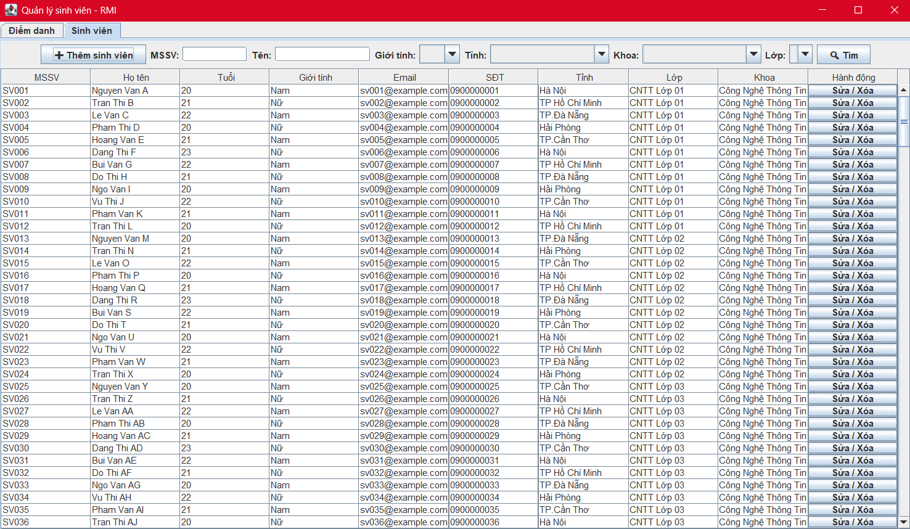
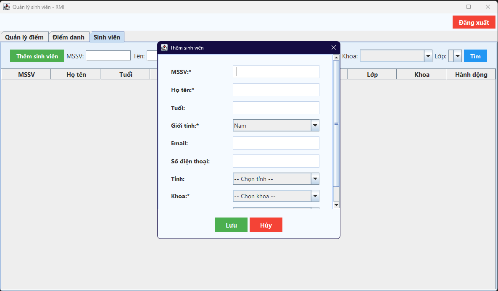
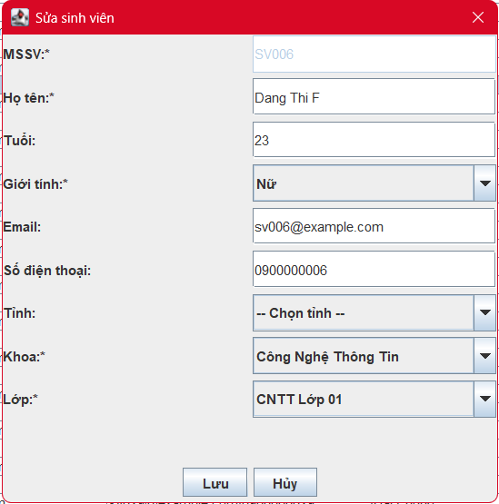
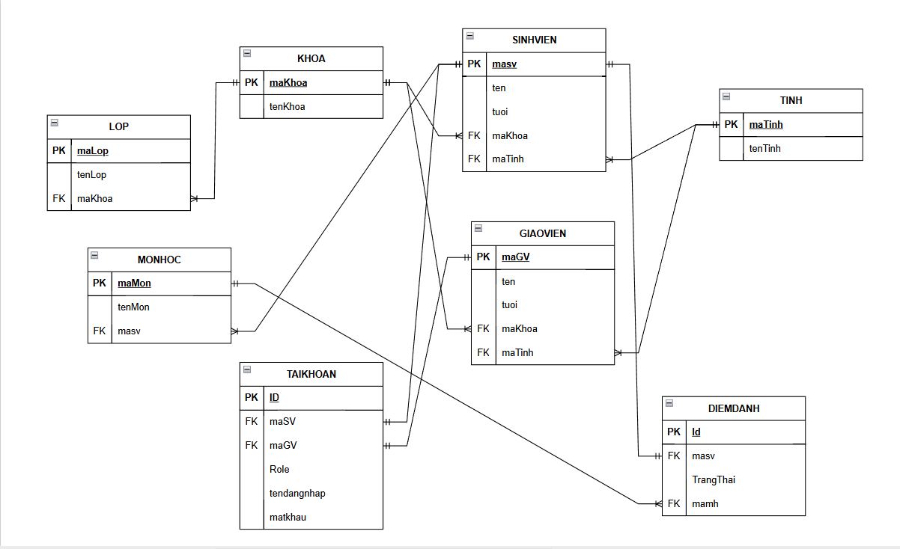

<h2 align="center">
    <a href="https://dainam.edu.vn/vi/khoa-cong-nghe-thong-tin">
    🎓 Faculty of Information Technology (DaiNam University)
    </a>
</h2>
<h2 align="center">
   QUẢN LÝ SINH VIÊN BẰNG RMI
</h2>
<div align="center">
    <p align="center">
        
        
        
    </p>

[](https://www.facebook.com/DNUAIoTLab)
[](https://dainam.edu.vn/vi/khoa-cong-nghe-thong-tin)
[](https://dainam.edu.vn)

</div>

## 📖 1. Giới thiệu ứng dụng

Ứng dụng **Quản lý sinh viên bằng RMI** là một hệ thống phần mềm cho phép quản lý thông tin sinh viên một cách tập trung và hiệu quả thông qua kiến trúc phân tán sử dụng Java RMI (Remote Method Invocation). Hệ thống bao gồm một máy chủ (Server) cung cấp các dịch vụ quản lý sinh viên và một máy khách (Client) với giao diện đồ họa (GUI) giúp người dùng tương tác trực quan.

**✨ Tính năng chính**
- ➕ Thêm sinh viên - Cho phép thêm sinh viên mới vào hệ thống
- ✏️ Sửa thông tin - Cập nhật thông tin sinh viên hiện có
- 🗑️ Xóa sinh viên - Xóa sinh viên khỏi cơ sở dữ liệu
- 🔍 Tìm kiếm - Tìm kiếm sinh viên theo tên hoặc MSSV
- 🔌 Điểm danh - Điểm danh sinh viên và xuất thành file excel
- 📊 Thống kê - Hiển thị thống kê số lượng sinh viên theo trạng thái
- 🎨 Giao diện trực quan - Tô màu phân biệt trạng thái sinh viên
- 💾 Lưu trữ tập trung - Dữ liệu được lưu trữ trong cơ sở dữ liệu Oracle
- 💻 Đăng ký/ Đăng nhập - Đăng ký/ Đăng nhập chia role
- 📥 Đăng ký Môn học - Đăng ký môn học
 

## 🛠️ 2. Công nghệ sử dụng

- **💻 Ngôn ngữ lập trình:** Java
- **🌐 Giao thức phân tán:** Java RMI (Remote Method Invocation)
- **🗃️ Cơ sở dữ liệu:** Oracle Database
- **🎨 Giao diện người dùng:** Java Swing
- **🔌 Kết nối cơ sở dữ liệu:** JDBC (Oracle Driver)
- **⚙️ Công cụ phát triển:** IntelliJ IDEA / Eclipse / NetBeans

## 📸 3. Một số hình ảnh hệ thống

### 🖼️ Giao diện chính


### ➕ Thêm sinh viên mới


### ✏️ Sửa thông tin sinh viên 


### 🔍 Điểm danh


## 📥 4. Các bước cài đặt

### ⚙️ Yêu cầu hệ thống:
- Hệ điều hành: Windows 10/11, macOS, Linux

- Java Development Kit (JDK): Phiên bản 8 trở lên

- Oracle Database: 11g, 19c hoặc Oracle XE

- Bộ nhớ RAM: Tối thiểu 4GB (khuyến nghị 8GB)

- Ổ đĩa trống: Tối thiểu 2GB

### 🔧 Cài đặt chi tiết:

#### Bước 1: Cài đặt Java JDK
- Kiểm tra phiên bản Java: 
```bash 
    java -version
```

- Tải JDK từ website Oracle: https://www.oracle.com/java/technologies/javase-downloads.html

#### Bước 2: Cài đặt Oracle Database
1. Tải Oracle Database Express Edition (XE) từ website chính thức

2. Cài đặt theo hướng dẫn

3. Thiết lập mật khẩu cho system user

#### Bước 3: Clone mã nguồn
 ```bash
git clone https://github.com/your-repo/student-management-rmi.git  
```
```bash
cd student-management-rmi
```
#### Bước 4: Cấu hình cơ sở dữ liệu
1. Kết nối đến Oracle bằng SQLPlus
2. Chạy script tạo bảng
- Tạo bảng KHOA
```bash
CREATE TABLE KHOA (
    MAKHOA VARCHAR2(10) NOT NULL PRIMARY KEY,
    TENKHOA VARCHAR2(100) NOT NULL
);
```
- Tạo bảng LOP
```bash
CREATE TABLE LOP (
    MALOP VARCHAR2(10) NOT NULL PRIMARY KEY,
    TENLOP VARCHAR2(100) NOT NULL,
    MAKHOA VARCHAR2(10) NOT NULL,
    CONSTRAINT fk_lop_khoa FOREIGN KEY (MAKHOA)
        REFERENCES KHOA(MAKHOA)
);
```
- Tạo bảng MON
```bash
CREATE TABLE MONHOC (
    MAMH VARCHAR2(10) NOT NULL PRIMARY KEY,
    TENMH VARCHAR2(100) NOT NULL,
    SOTINCHI NUMBER NOT NULL
);
```
- Tạo bảng DIEM
```bash
CREATE TABLE DIEM (
    MASV VARCHAR2(10) NOT NULL,
    MAMH VARCHAR2(10) NOT NULL,
    DIEMQT NUMBER(5,2),
    DIEMCK NUMBER(5,2),
    DIEMTK NUMBER(5,2),
    CONSTRAINT pk_diem PRIMARY KEY (MASV, MAMH),
    CONSTRAINT fk_diem_sv FOREIGN KEY (MASV)
        REFERENCES SINHVIEN(MASV),
    CONSTRAINT fk_diem_mh FOREIGN KEY (MAMH)
        REFERENCES MONHOC(MAMH)
);
```
- Tạo bảng DIEMDANH
```bash
CREATE TABLE DIEMDANH (
    ID NUMBER NOT NULL PRIMARY KEY,
    MASV VARCHAR2(10) NOT NULL,
    NGAY DATE NOT NULL,
    TRANGTHAI CHAR(1),
    CONSTRAINT fk_nghi_sv FOREIGN KEY (MASV)
        REFERENCES SINHVIEN(MASV)
);
```

- Tạo bảng TINH
```bash
CREATE TABLE TINH (
    MATINH VARCHAR2(5) NOT NULL PRIMARY KEY,
    TENTINH VARCHAR2(100) NOT NULL
);
```
- Tạo bảng SINHVIEN
```bash
CREATE TABLE SINHVIEN (
    MASV VARCHAR2(10) NOT NULL PRIMARY KEY,
    HOTEN VARCHAR2(100) NOT NULL,
    TUOI NUMBER(3),
    EMAIL VARCHAR2(100),
    GIOITINH CHAR(1),
    SDT VARCHAR2(15),
    MATINH VARCHAR2(5),
    MALOP VARCHAR2(10) NOT NULL,
    MAKHOA VARCHAR2(10) NOT NULL,
    CONSTRAINT fk_sv_lop FOREIGN KEY (MALOP)
        REFERENCES LOP(MALOP),
    CONSTRAINT fk_sv_khoa FOREIGN KEY (MAKHOA)
        REFERENCES KHOA(MAKHOA),
    CONSTRAINT fk_sv_tinh FOREIGN KEY (MATINH)
        REFERENCES TINH(MATINH)
);
```
- Tạo bảng TAIKHOAN
```bash
CREATE TABLE APPUSER (
    USERNAME VARCHAR2(50) NOT NULL PRIMARY KEY,
    PASSWORD VARCHAR2(255) NOT NULL,
    ROLE VARCHAR2(20),
    MASV VARCHAR2(10),
    CONSTRAINT fk_user_sv FOREIGN KEY (MASV)
        REFERENCES SINHVIEN(MASV)
);
```
- Biểu đổ ERD  


#### Bước 5: Cấu hình kết nối database
- Chỉnh sửa file DBConnection.java:  
 ```bash
String url = "jdbc:oracle:thin:@localhost:1521:xe"; 
``` 
```bash
String user = "system"; 
```
 ```bash 
String password = "your_password";  
```

#### Bước 6: Chạy ứng dụng
1. Khởi động Server:  
```bash
cd src
```
```bash
java Server.Server
```
2. Khởi động Client:  
```bash
java Client.MainClient
```

## 📞 5. Liên hệ

Nếu có bất kỳ thắc mắc hay góp ý nào, vui lòng liên hệ:

- **📍 Địa chỉ:** Hà Đông, Hà Nội  
- **📧 Email:** tavietanh101004@gmail.com 
---

© 2023 - Khoa Công nghệ Thông tin - Đại học Đại Nam 